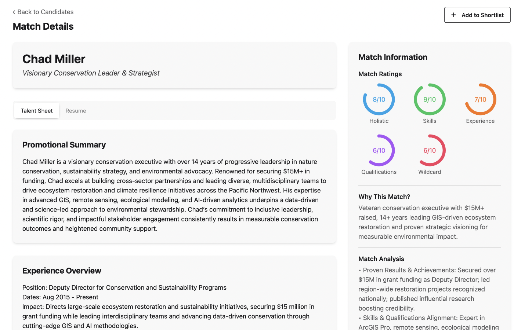
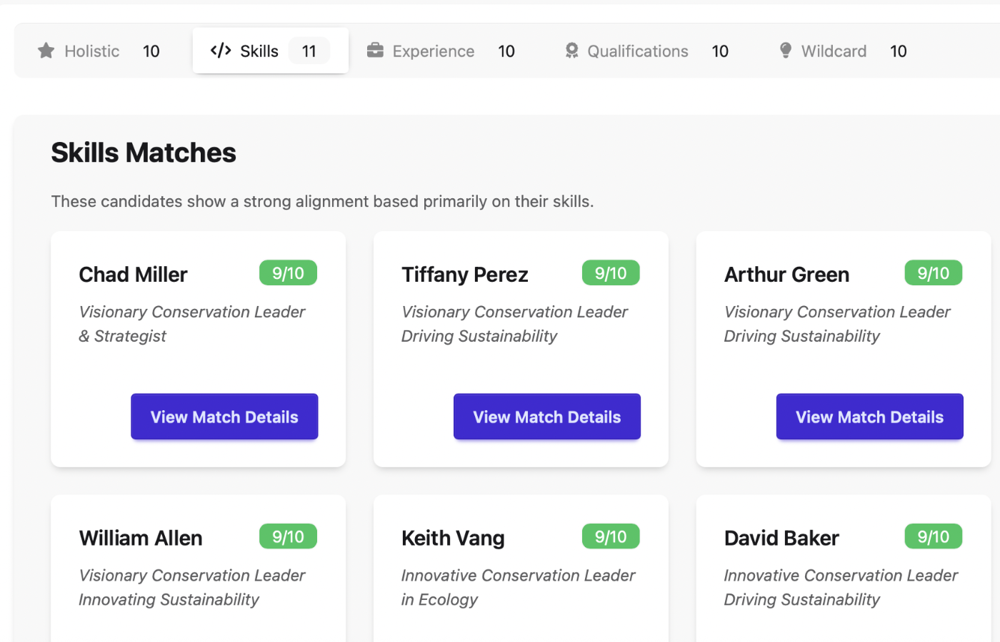
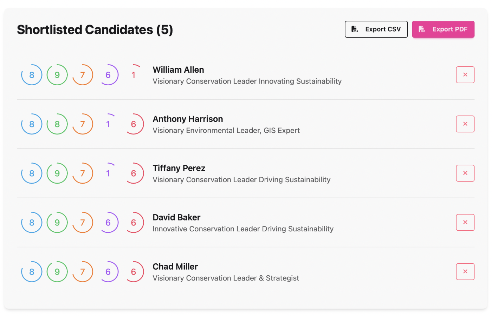

# Hiredar

> Project status: Sunset (open-sourced under MIT). Hiredar is no longer under active development. It was a fully-functioning SaaS used in production, and the author has open‑sourced the codebase so others can learn from it and so the author can use it as a portfolio project. No hosted service or production support is provided. See `LICENSE` for terms.

Hiredar is an AI-assisted recruiting workspace built for in-house and agency teams that already own rich résumé backlogs. Recruiters upload folders or ZIPs of résumés, our Django/Celery pipeline structures every profile, and the matching engine ranks candidates with explainable AI so shortlists, wildcard pools, and reports stay current without manual spreadsheet work.

With a transparent, credit-based pricing model (100 free credits on day one, then pay-as-you-go), recruiters decide exactly when to spend budget. No subscriptions.

Elevator Pitch:

Recruiting teams shouldn't lose track of talent they've already sourced. Hiredar turns dormant résumé libraries into ranked, explainable shortlists, ready to export or share with hiring managers. Process resumes when you need to, review AI-backed rationale you can trust, and keep the entire workflow inside a recruiter-controlled dashboard.

## Screenshots

## Example User Flow

1. Onboarding & Sign-Up:
   - The recruiter visits the Welcome & Sign-Up Screen, selects "Sign Up," and enters their email and basic details.
   - After account creation, they are directed to the Recruiter Dashboard.
2. Job Opening Creation:
   - From the dashboard, the recruiter clicks "Create New Job Opening."
   - They fill in job details (title, description, required skills, and advanced criteria) on the Job Posting Creation Screen and then hit "Create Job Opening."
   - The system confirms the job opening is saved and immediately begins matching candidates using the AI engine.
3. Bulk Resume Ingestion & AI-Driven Parsing Pipeline:
   - The recruiter securely uploads a folder or ZIP of PDF resumes for a specific job opening.
   - Each file is queued for background processing using Celery.
   - **Pipeline Steps:**
     - **Text Extraction:** PDF → Plain text
     - **LLM Conversion:** Text → Structured XML (using OpenAI APIs)
     - **XML Parsing:** Extract skills, experience, education, certifications
     - **Tagline Generation:** Personal identity snippets for recruiter outreach
     - **Progress Tracking:** Real-time stepper to monitor pipeline stages
4. Reviewing Candidate Matches:
   - The recruiter navigates to the Candidate List Screen via the dashboard.
   - They see a segmented list with "Top Matches" and "Wildcard Candidates" for the newly posted job.
   - Sorting and filtering options allow them to focus on key criteria (e.g., years of experience, specific skills).
   - The AI matching engine ranks candidates by skill fit, experience level, and role criteria.
5. Candidate Details & Engagement:
   - The recruiter clicks on a candidate card to open the Candidate Detail Screen.
   - The screen shows detailed profile information along with an AI-generated explanation for the match.
   - The recruiter uses action buttons to send a message or schedule an interview directly through the platform.
6. Account Management:
   - The recruiter accesses the Account & Settings Screen to update billing information or modify notification settings as needed.
   - Export match results as CSV or PDF for external outreach if desired.

## Core Features

- **Bulk Resume Ingestion**
  - Securely upload a folder or ZIP of PDF resumes.
  - Each file is queued for background processing using Celery.
- **AI‑Driven Parsing Pipeline**
  - **Text Extraction:** PDF → Plain text
  - **LLM Conversion:** Text → Structured XML (OpenAI APIs)
  - **XML Parsing:** Extract skills, experience, education, certifications
  - **Tagline Generation:** Personal identity snippets for recruiter outreach
  - **Progress Tracking:** Real‑time stepper to monitor pipeline stages
- **Candidate Matching Engine**
  - Provide a job description or role specification.
  - AI matches the parsed resume data to your criteria.
  - Receive a ranked list of top candidates, with explanations for each match.
- **Recruiter Dashboard**
  - View upload history and processing status.
  - Drill into individual candidate profiles.
  - Export match results as CSV or PDF.
- **Multiple Candidate Views**
  - Top matches, wildcard candidates, and other AI-driven segmentations.

## Competitive Research Context

- **Primary User Persona:** Experienced technical recruiters managing high-volume hiring for multiple roles, struggling with manual resume screening and lacking unified candidate insights.
- **Core Workflows:**
  1. Bulk upload of PDF resumes tied to a specific job opening
  2. AI-powered parsing pipeline (text extraction, LLM XML conversion, XML parsing, tagline generation, progress tracking)
  3. Matching engine that ranks candidates by skill fit, experience level, and role criteria
  4. Exporting or reviewing match lists for external outreach
- **Key Features & Value Propositions:**
  - Automated structured data extraction from unstructured resumes
  - Multi‑lens AI matching (skills lens, experience lens, role‑specific criteria)
  - AI-generated personal taglines for rapid candidate understanding
  - Real‑time progress dashboard and status tracking
  - Ease of integration: Django backend, HTMX interactivity, Tailwind/DaisyUI styling, Celery for background processing
- **Business Objectives:**
  - Reduce time-to-hire by automating resume intake and screening
  - Improve match quality with data-driven AI ranking and insights
  - Minimize recruiter workload by surfacing top candidates instantaneously
- **Competitive Landscape:**
  - Applicant Tracking Systems (ATS) with resume parsing
  - AI-powered sourcing tools and screening platforms
  - Resume screening software, candidate rediscovery features
  - Diversity & inclusion AI solutions and blind screening tools

## Tech Stack

- **Django 5.2** with class-based views for backend
- **Allauth Django plugin** for user auth management
- **HTMX** for interactivity
- **Tailwind CSS** with **DaisyUI** for UI styling
- **Celery** for asynchronous task processing and background jobs
- **OpenAI APIs** for XML conversion and AI features
