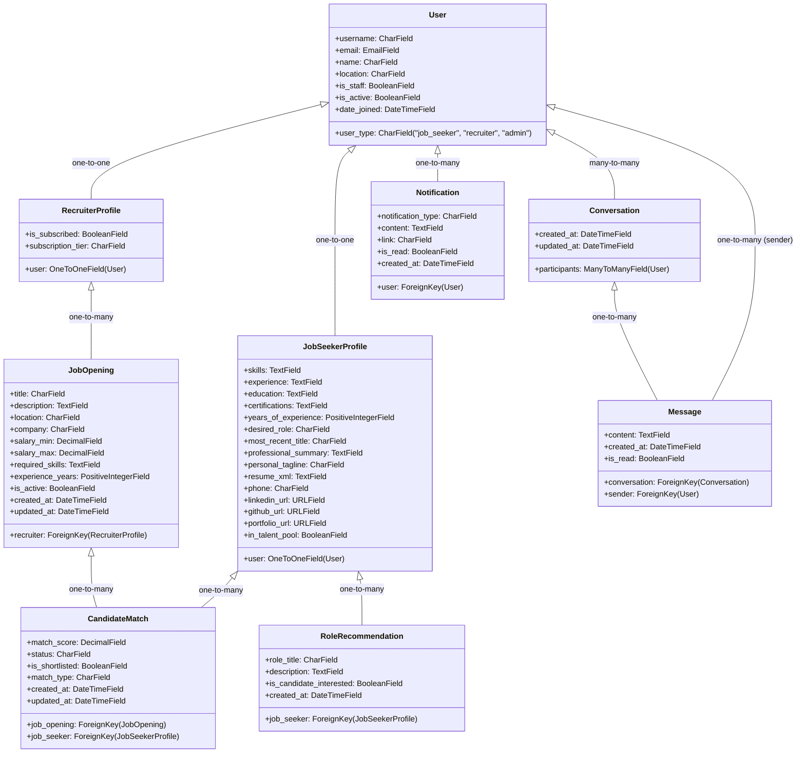

# Hiredar Model Structure

This document provides a comprehensive overview of all models in the Hiredar application, their attributes, relationships, and key methods.

## Overview Diagram

## Authentication App

### User

The custom User model that serves as the base for all user accounts.

**Fields:**
| Field | Type | Description |
|-------|------|-------------|
| `username` | CharField | Auto-generated username based on email (format: `emailprefix_randomsuffix`) |
| `email` | EmailField | Primary login field, must be unique |
| `name` | CharField | User's name |
| `user_type` | CharField | One of "job_seeker", "recruiter", or "admin" |
| `location` | CharField | User's location |
| `is_staff` | BooleanField | Whether user can access admin site |
| `is_active` | BooleanField | Whether user account is active |
| `date_joined` | DateTimeField | When the user joined |

**Key Methods:**
| Method | Description |
|--------|-------------|
| `get_full_name()` | Returns the user's name |
| `get_short_name()` | Returns the user's name |
| `to_dict()` | Converts user instance to a dictionary |
| `get_initials()` | Gets user initials for avatar display (from name parts) |
| `get_absolute_url()` | Returns URL for the user's profile |
| `clean()` | Validates that only admin users can have staff privileges |

**Business Rules:**
- Only users with `user_type="admin"` can have `is_staff=True`
- Setting `is_staff=True` on a non-admin user will automatically change their `user_type` to "admin"
- These rules are enforced through model validation, admin customization, and a pre-save signal

## Job Seekers App

### JobSeekerProfile

Extended profile for job seekers with career-related information.

**Fields:**
| Field | Type | Description |
|-------|------|-------------|
| `user` | OneToOneField | Link to User model (with user_type="job_seeker") |
| `skills` | TextField | Comma-separated list of skills |
| `experience` | TextField | Description of work experience |
| `education` | TextField | Description of educational background |
| `certifications` | TextField | Description of professional certifications |
| `years_of_experience` | PositiveIntegerField | Total years of experience |
| `desired_role` | CharField | Desired job role |
| `most_recent_title` | CharField | Most recent job title extracted from resume |
| `professional_summary` | TextField | Detailed description about the job seeker's qualifications and experience |
| `personal_tagline` | CharField | AI-generated personal identity tagline |
| `resume_xml` | TextField | XML representation of the parsed resume |
| `phone` | CharField | Phone number |
| `linkedin_url` | URLField | LinkedIn profile URL |
| `github_url` | URLField | GitHub profile URL |
| `portfolio_url` | URLField | Portfolio website URL |
| `in_talent_pool` | BooleanField | Whether the job seeker is active in the talent pool and available for matching |

**Key Methods:**
| Method | Description |
|--------|-------------|
| `skills_list` | Property that returns a list of skill names |

### ResumeProcessingTaskProgress

Model for tracking progress of resume processing tasks.

**Fields:**
| Field | Type | Description |
|-------|------|-------------|
| `task_id` | CharField | Django Q2 task ID (primary key) |
| `user` | ForeignKey | Link to User who uploaded the resume |
| `task_type` | CharField | Type of task being processed (default: "resume_processing") |
| `current_step` | CharField | Current step being processed |
| `progress_percent` | IntegerField | Overall progress percentage (0-100) |
| `steps_completed` | TextField | JSON list of completed steps |
| `status` | CharField | Task status (pending/running/completed/failed) |
| `message` | TextField | Status message or error details |
| `created_at` | DateTimeField | When the task was created |
| `updated_at` | DateTimeField | When the task was last updated |

**Key Methods:**
| Method | Description |
|--------|-------------|
| `clean_up_old_records` | Class method to clean up old records beyond a certain age |
| `clean_up_completed_records` | Class method to clean up completed/failed records |
| `completed_steps` | Property that returns a list of completed step IDs |
| `mark_step_complete` | Marks a specific step as complete and updates progress |
| `to_dict` | Converts task progress to a dictionary for API responses |

**Business Rules:**
- The model tracks predefined steps in the resume processing pipeline
- Each step has a weight that contributes to the overall progress percentage
- Completed records are automatically cleaned up after a configurable time period

### RoleRecommendation

Model for AI-generated role recommendations for job seekers.

**Fields:**
| Field | Type | Description |
|-------|------|-------------|
| `job_seeker` | ForeignKey | Link to the JobSeekerProfile this role recommendation is for |
| `role_title` | CharField | Title of the recommended role, in title case (e.g., 'Senior Software Engineer') |
| `description` | TextField | A concise description of the role, outlining key responsibilities and value proposition |
| `is_candidate_interested` | BooleanField | Indicates whether the job seeker has expressed interest in this role (default: False) |
| `created_at` | DateTimeField | When this recommendation was generated |

**Key Methods:**
| Method | Description |
|--------|-------------|
| No specific methods beyond default | |

**Business Rules:**
| Rule | Description |
|------|-------------|
| Ordering | Role recommendations are ordered alphabetically by role title |

## Recruiters App

### RecruiterProfile

Extended profile for recruiters with subscription information.

**Fields:**
| Field | Type | Description |
|-------|------|-------------|
| `user` | OneToOneField | Link to User model (with user_type="recruiter") |
| `is_subscribed` | BooleanField | Whether recruiter has an active subscription |
| `subscription_tier` | CharField | Subscription tier (basic/professional/enterprise) |

### JobOpening

Model for job openings posted by recruiters.

**Fields:**
| Field | Type | Description |
|-------|------|-------------|
| `recruiter` | ForeignKey | Link to RecruiterProfile that posted the job |
| `title` | CharField | Job title |
| `description` | TextField | Detailed job description |
| `location` | CharField | Job location |
| `company` | CharField | Company offering this position |
| `salary_min` | DecimalField | Minimum salary offered |
| `salary_max` | DecimalField | Maximum salary offered |
| `required_skills` | TextField | Comma-separated list of required skills |
| `experience_years` | PositiveIntegerField | Required years of experience |
| `is_active` | BooleanField | Whether the job opening is active |
| `created_at` | DateTimeField | When the job was created |
| `updated_at` | DateTimeField | When the job was last updated |

**Key Methods:**
| Method | Description |
|--------|-------------|
| `required_skills_list` | Property that returns a list of required skill names |

## Matching App

### CandidateMatch

Model for matching job seekers to job openings.

**Fields:**
| Field | Type | Description |
|-------|------|-------------|
| `job_opening` | ForeignKey | Link to the JobOpening in the recruiters app |
| `job_seeker` | ForeignKey | Link to the JobSeekerProfile |
| `match_score` | DecimalField | Match score between 0 and 100 |
| `status` | CharField | Status of the match (pending/accepted/rejected/withdrawn) |
| `is_shortlisted` | BooleanField | Whether the candidate is shortlisted |
| `match_type` | CharField | Type of match (top/wildcard) |
| `created_at` | DateTimeField | When the match was created |
| `updated_at` | DateTimeField | When the match was last updated |

## Messaging App

### Conversation

Model for conversations between users.

**Fields:**
| Field | Type | Description |
|-------|------|-------------|
| `participants` | ManyToManyField | Users participating in the conversation |
| `created_at` | DateTimeField | When the conversation was created |
| `updated_at` | DateTimeField | When the conversation was last updated |

**Key Methods:**
| Method | Description |
|--------|-------------|
| `get_other_participant()` | Get the other participant in a conversation |
| `other_participant` | Property to get the other participant (for templates) |

### Message

Model for messages within a conversation.

**Fields:**
| Field | Type | Description |
|-------|------|-------------|
| `conversation` | ForeignKey | Link to the Conversation |
| `sender` | ForeignKey | User who sent the message |
| `content` | TextField | Message content |
| `created_at` | DateTimeField | When the message was sent |
| `is_read` | BooleanField | Whether the message has been read |

### Notification

Model for user notifications.

**Fields:**
| Field | Type | Description |
|-------|------|-------------|
| `user` | ForeignKey | User to notify |
| `notification_type` | CharField | Type of notification (message/match/application/system) |
| `content` | TextField | Notification content |
| `link` | CharField | URL to link to |
| `is_read` | BooleanField | Whether the notification has been read |
| `created_at` | DateTimeField | When the notification was created |

## Model Relationships

### User Relationships
- One-to-One with JobSeekerProfile (for job seeker users)
- One-to-One with RecruiterProfile (for recruiter users)
- Many-to-Many with Conversation (as participants)
- One-to-Many with Message (as sender)
- One-to-Many with Notification (as recipient)

### JobSeekerProfile Relationships
- One-to-One with User
- One-to-Many with CandidateMatch in the matching app (as job_seeker)
- One-to-Many with RoleRecommendation (as job_seeker)

### RecruiterProfile Relationships
- One-to-One with User
- One-to-Many with JobOpening (as recruiter)

### JobOpening Relationships
- Many-to-One with RecruiterProfile (as recruiter)
- One-to-Many with CandidateMatch in the matching app (as job_opening)

### Conversation Relationships
- Many-to-Many with User (as participants)
- One-to-Many with Message (as conversation)

## Database Schema Notes

- The application uses a custom User model with email-based authentication
- Profiles are created automatically via signals when a user is created
- All models use proper foreign key constraints for data integrity
- Most models include timestamps for created_at/updated_at 