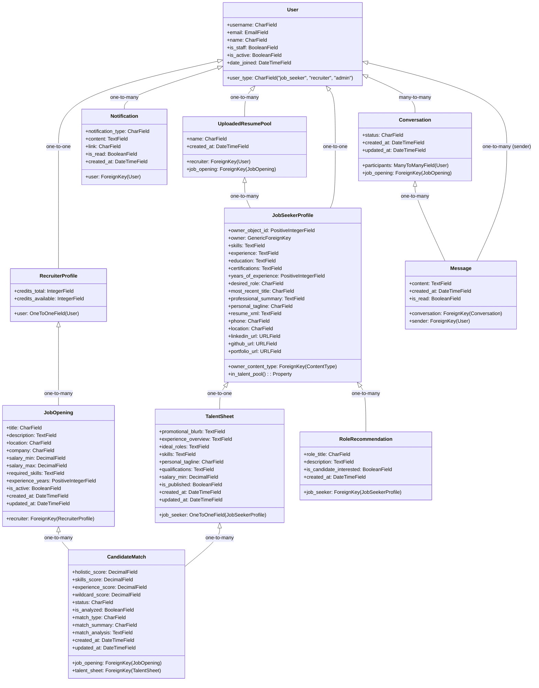

# Hiredar Model Structure

This document provides a comprehensive overview of all models in the Hiredar application, their attributes, relationships, and key methods.

## Overview Diagram

## Authentication App

### User

The custom User model that serves as the base for all user accounts.

**Fields:**
| Field | Type | Description |
|-------|------|-------------|
| `username` | CharField | Auto-generated username based on email (format: `emailprefix_randomsuffix`) |
| `email` | EmailField | Primary login field, must be unique |
| `name` | CharField | User's name |
| `user_type` | CharField | One of "job_seeker", "recruiter", or "admin" |
| `is_staff` | BooleanField | Whether user can access admin site |
| `is_active` | BooleanField | Whether user account is active |
| `date_joined` | DateTimeField | When the user joined |

**Key Methods:**
| Method | Description |
|--------|-------------|
| `get_full_name()` | Returns the user's name |
| `get_short_name()` | Returns the user's name |
| `to_dict()` | Converts user instance to a dictionary |
| `get_initials()` | Gets user initials for avatar display (from name parts) |
| `get_absolute_url()` | Returns URL for the user's profile |
| `clean()` | Validates that only admin users can have staff privileges |

**Business Rules:**
- Only users with `user_type="admin"` can have `is_staff=True`
- Setting `is_staff=True` on a non-admin user will automatically change their `user_type` to "admin"
- These rules are enforced through model validation, admin customization, and a pre-save signal

## Job Seekers App

### JobSeekerProfile

Extended profile for job seekers with career-related information. This model uses a polymorphic ownership pattern, meaning it can be owned by either a User or an UploadedResumePool through a generic relation.

**Fields:**
| Field | Type | Description |
|-------|------|-------------|
| `owner_content_type` | ForeignKey | ContentType for polymorphic relationship |
| `owner_object_id` | PositiveIntegerField | Object ID for polymorphic relationship |
| `owner` | GenericForeignKey | Combined field linking to either User or UploadedResumePool |
| `skills` | TextField | Pipe-separated list of skills |
| `experience` | TextField | Description of work experience |
| `education` | TextField | Description of educational background |
| `certifications` | TextField | Description of professional certifications |
| `years_of_experience` | PositiveIntegerField | Total years of experience |
| `desired_role` | CharField | Desired job role |
| `most_recent_title` | CharField | Most recent job title extracted from resume |
| `professional_summary` | TextField | Detailed description about the job seeker's qualifications and experience |
| `personal_tagline` | CharField | AI-generated personal identity tagline |
| `resume_xml` | TextField | XML representation of the parsed resume |
| `phone` | CharField | Phone number |
| `location` | CharField | Job seeker's location |
| `linkedin_url` | URLField | LinkedIn profile URL |
| `github_url` | URLField | GitHub profile URL |
| `portfolio_url` | URLField | Portfolio website URL |

**Key Methods:**
| Method | Description |
|--------|-------------|
| `skills_list` | Property that returns a list of skill names from the pipe-separated skills field |
| `in_talent_pool` | Property that determines if the job seeker is in the talent pool based on whether they have a published talent sheet |
| `uploaded_resume_pool` | Property that returns the UploadedResumePool owner if applicable |
| `user_owner` | Property that returns the User owner if applicable |

**Business Rules:**
- A JobSeekerProfile can be owned by either a User or an UploadedResumePool
- If owned by a User, it represents a job seeker who registered on the platform
- If owned by an UploadedResumePool, it represents a resume uploaded by a recruiter

### UploadedResumePool

Represents a batch of resumes uploaded by a recruiter for a specific job opening.

**Fields:**
| Field | Type | Description |
|-------|------|-------------|
| `recruiter` | ForeignKey | Link to the User who created this pool (with user_type="recruiter") |
| `job_opening` | ForeignKey | Job opening associated with this pool (optional, non-ownership) |
| `name` | CharField | Label for this pool (e.g., "March 2024 Upload") |
| `created_at` | DateTimeField | When the pool was created |

**Key Methods:**
| Method | Description |
|--------|-------------|
| `__str__` | Returns a string representation with pool name and recruiter email |

**Business Rules:**
| Rule | Description |
|------|-------------|
| Ownership | Resume pools belong to a recruiter, and may optionally be linked to a job opening |
| Polymorphic Owner | Serves as a potential owner for JobSeekerProfile instances through the GenericForeignKey |
| Purpose | Used for batch-processing resumes without requiring job seekers to register |

### ResumeProcessingTaskProgress

Model for tracking progress of resume processing tasks.

**Fields:**
| Field | Type | Description |
|-------|------|-------------|
| `task_id` | CharField | Django Q2 task ID (primary key) |
| `user` | ForeignKey | Link to User who uploaded the resume |
| `task_type` | CharField | Type of task being processed (default: "resume_processing") |
| `current_step` | CharField | Current step being processed |
| `progress_percent` | IntegerField | Overall progress percentage (0-100) |
| `steps_completed` | TextField | JSON list of completed steps |
| `status` | CharField | Task status (pending/running/completed/failed) |
| `message` | TextField | Status message or error details |
| `created_at` | DateTimeField | When the task was created |
| `updated_at` | DateTimeField | When the task was last updated |

**Key Methods:**
| Method | Description |
|--------|-------------|
| `clean_up_old_records` | Class method to clean up old records beyond a certain age |
| `clean_up_completed_records` | Class method to clean up completed/failed records |
| `completed_steps` | Property that returns a list of completed step IDs |
| `mark_step_complete` | Marks a specific step as complete and updates progress |
| `to_dict` | Converts task progress to a dictionary for API responses |

**Business Rules:**
- The model tracks predefined steps in the resume processing pipeline
- Each step has a weight that contributes to the overall progress percentage
- Completed records are automatically cleaned up after a configurable time period

### RoleRecommendation

Model for AI-generated role recommendations for job seekers.

**Fields:**
| Field | Type | Description |
|-------|------|-------------|
| `job_seeker` | ForeignKey | Link to the JobSeekerProfile this role recommendation is for |
| `role_title` | CharField | Title of the recommended role, in title case (e.g., 'Senior Software Engineer') |
| `description` | TextField | A concise description of the role, outlining key responsibilities and value proposition |
| `is_candidate_interested` | BooleanField | Indicates whether the job seeker has expressed interest in this role (default: False) |
| `created_at` | DateTimeField | When this recommendation was generated |

**Key Methods:**
| Method | Description |
|--------|-------------|
| `__str__` | Returns a string representation with role title and job seeker name |
| `uploaded_resume_pool` | Property that accesses the resume pool through the job_seeker relationship |

**Business Rules:**
| Rule | Description |
|------|-------------|
| Ordering | Role recommendations are ordered alphabetically by role title |

### TalentSheet

AI-generated talent sheet for job seekers in the talent pool.

This represents a comprehensive, recruiter-friendly presentation of a job seeker's qualifications, tailored for the talent pool. Generated when a job seeker opts into the talent pool, this sheet provides a structured presentation of skills, experience, and career goals that makes it easier for recruiters to quickly assess suitability for open positions.

**Fields:**
| Field | Type | Description |
|-------|------|-------------|
| `job_seeker` | OneToOneField | Link to the JobSeekerProfile this talent sheet is for |
| `promotional_blurb` | TextField | AI-generated promotional summary highlighting the candidate's unique value proposition |
| `experience_overview` | TextField | Abbreviated overview of the candidate's recent employment experience and demonstrated impact |
| `ideal_roles` | TextField | Comma-separated list of ideal roles, populated from interested role recommendations |
| `skills` | TextField | Pipe-separated list of skills copied from JobSeekerProfile |
| `personal_tagline` | CharField | AI-generated personal identity tagline |
| `qualifications` | TextField | Education and certifications concatenated from JobSeekerProfile |
| `salary_min` | DecimalField | Minimum salary expectation |
| `is_published` | BooleanField | Whether this talent sheet is published and available for matching to job openings |
| `created_at` | DateTimeField | When the talent sheet was created |
| `updated_at` | DateTimeField | When the talent sheet was last updated |

**Key Methods:**
| Method | Description |
|--------|-------------|
| `__str__` | Returns a string representation with user name or profile ID |
| `ideal_roles_list` | Property that returns a list of ideal roles from the comma-separated string |
| `uploaded_resume_pool` | Property that accesses the resume pool through the job_seeker relationship |

**Business Rules:**
| Rule | Description |
|------|-------------|
| Talent Pool Participation | A job seeker is considered to be in the talent pool if they have a published talent sheet |
| Publication State | Controls whether the talent sheet appears in search results for recruiters |

## Recruiters App

### RecruiterProfile

Extended profile for recruiters with subscription information.

**Fields:**
| Field | Type | Description |
|-------|------|-------------|
| `user` | OneToOneField | Link to User model (with user_type="recruiter") |
| `credits_total` | IntegerField | Total credits ever purchased by the recruiter (default: 100) |
| `credits_available` | IntegerField | Credits currently available to spend (default: 100) |

**Key Methods:**
| Method | Description |
|--------|-------------|
| `__str__` | Returns a string representation with recruiter email |

**Business Rules:**
| Rule | Description |
|------|-------------|
| Credit Purchase | Recruiters purchase credits in bundles via Stripe; credits are required for premium actions (e.g., resume processing). |
| Credit Deduction | Credits are automatically deducted when a premium action is completed. |
| No Subscriptions | There are no subscription tiers or recurring payments. |

### JobOpening

Model for job openings posted by recruiters.

**Fields:**
| Field | Type | Description |
|-------|------|-------------|
| `recruiter` | ForeignKey | Link to RecruiterProfile that posted the job |
| `title` | CharField | Job title |
| `description` | TextField | Detailed job description |
| `location` | CharField | Job location |
| `company` | CharField | Company offering this position |
| `salary_min` | DecimalField | Minimum salary offered |
| `salary_max` | DecimalField | Maximum salary offered |
| `required_skills` | TextField | Comma-separated list of required skills |
| `experience_years` | PositiveIntegerField | Required years of experience |
| `is_active` | BooleanField | Whether the job opening is active |
| `created_at` | DateTimeField | When the job was created |
| `updated_at` | DateTimeField | When the job was last updated |

**Key Methods:**
| Method | Description |
|--------|-------------|
| `required_skills_list` | Property that returns a list of required skill names |

## Matching App

### CandidateMatch

Model for matching talent sheets to job openings.

**Fields:**
| Field | Type | Description |
|-------|------|-------------|
| `job_opening` | ForeignKey | Link to the JobOpening in the recruiters app |
| `talent_sheet` | ForeignKey | Link to the TalentSheet in the job_seekers app |
| `holistic_score` | DecimalField | Overall match score between 0.0 and 1.0 |
| `skills_score` | DecimalField | Skills-based match score between 0.0 and 1.0 |
| `experience_score` | DecimalField | Experience-based match score between 0.0 and 1.0 |
| `wildcard_score` | DecimalField | Wildcard match score between 0.0 and 1.0 |
| `status` | CharField | Status of the match (identified/open/contacted/candidate_interested/candidate_declined/recruiter_rejected) |
| `is_analyzed` | BooleanField | Whether this match has been analyzed by AI |
| `match_type` | CharField | Primary type of match (holistic/skills/experience/wildcard) |
| `match_summary` | CharField | A headline summarizing why this is a good match |
| `match_analysis` | TextField | Detailed analysis of why this job and candidate match |
| `created_at` | DateTimeField | When the match was created |
| `updated_at` | DateTimeField | When the match was last updated |

**Key Methods:**
| Method | Description |
|--------|-------------|
| `__str__` | Returns a string representation that includes job seeker name, job opening, match score, and match type |
| `get_score_for_type` | Returns the score for the current match type |
| `get_rating_for_type` | Returns the rating (1-10) for the current match type |
| `holistic_rating` | Property that returns the holistic score as a 1-10 rating |
| `skills_rating` | Property that returns the skills score as a 1-10 rating |
| `experience_rating` | Property that returns the experience score as a 1-10 rating |
| `wildcard_rating` | Property that returns the wildcard score as a 1-10 rating |
| `get_all_match_ratings` | Returns ratings for all match types for this talent sheet and job |

**Business Rules:**
| Rule | Description |
|------|-------------|
| Uniqueness | Each combination of job_opening, talent_sheet, and match_type must be unique |
| Relationship | Links a talent sheet to a job opening, accessing the job seeker through the talent sheet |
| Ratings | Scores are stored as raw similarity scores (0.0-1.0) and converted to ratings (1-10) for display |

## Messaging App

### Conversation

Model for conversations between users.

**Fields:**
| Field | Type | Description |
|-------|------|-------------|
| `participants` | ManyToManyField | Users participating in the conversation |
| `job_opening` | ForeignKey | Link to JobOpening the conversation is about (optional) |
| `status` | CharField | Status of the conversation (interest_requested/candidate_interested/candidate_not_interested/active/archived) |
| `created_at` | DateTimeField | When the conversation was created |
| `updated_at` | DateTimeField | When the conversation was last updated |

**Key Methods:**
| Method | Description |
|--------|-------------|
| `get_other_participant()` | Get the other participant in a conversation |
| `other_participant` | Property to get the other participant (for templates) |

**Business Rules:**
| Rule | Description |
|------|-------------|
| Interest Flow | Conversations linked to job openings start with status "interest_requested" |
| Messaging Permissions | Messages can only be sent when status is "candidate_interested" or "active" |
| Resume Access | Recruiters can only view job seeker's full resume if status is "candidate_interested" |

### Message

Model for messages within a conversation.

**Fields:**
| Field | Type | Description |
|-------|------|-------------|
| `conversation` | ForeignKey | Link to the Conversation |
| `sender` | ForeignKey | User who sent the message |
| `content` | TextField | Message content |
| `created_at` | DateTimeField | When the message was sent |
| `is_read` | BooleanField | Whether the message has been read |

### Notification

Model for user notifications.

**Fields:**
| Field | Type | Description |
|-------|------|-------------|
| `user` | ForeignKey | User to notify |
| `notification_type` | CharField | Type of notification (message/match/application/system) |
| `content` | TextField | Notification content |
| `link` | CharField | URL to link to |
| `is_read` | BooleanField | Whether the notification has been read |
| `created_at` | DateTimeField | When the notification was created |

## Model Relationships

### User Relationships
- One-to-One with JobSeekerProfile (for job seeker users, through the polymorphic owner field)
- One-to-One with RecruiterProfile (for recruiter users)
- One-to-Many with UploadedResumePool (as recruiter)
- Many-to-Many with Conversation (as participants)
- One-to-Many with Message (as sender)
- One-to-Many with Notification (as recipient)

### JobSeekerProfile Relationships
- Polymorphic relationship with either User or UploadedResumePool (as owner)
- One-to-Many with RoleRecommendation (as job_seeker)
- One-to-One with TalentSheet (as job_seeker)

### UploadedResumePool Relationships
- Many-to-One with User (as recruiter)
- Many-to-One with JobOpening (optional)
- One-to-Many with JobSeekerProfile (through polymorphic ownership)

### RecruiterProfile Relationships
- One-to-One with User
- One-to-Many with JobOpening (as recruiter)

### JobOpening Relationships
- Many-to-One with RecruiterProfile (as recruiter)
- One-to-Many with UploadedResumePool (non-ownership)
- One-to-Many with CandidateMatch (as job_opening)
- One-to-Many with Conversation (as job_opening)

### Conversation Relationships
- Many-to-Many with User (as participants)
- Many-to-One with JobOpening (optional, as job_opening)
- One-to-Many with Message (as conversation)

### TalentSheet Relationships
- One-to-One with JobSeekerProfile (as job_seeker)
- One-to-Many with CandidateMatch (as talent_sheet)

## Database Schema Notes

- The application uses a custom User model with email-based authentication
- JobSeekerProfile uses polymorphic ownership to support both registered users and uploaded resumes
- Profiles for registered users are created automatically via signals when a user is created
- All models use proper foreign key constraints for data integrity
- Most models include timestamps for created_at/updated_at 