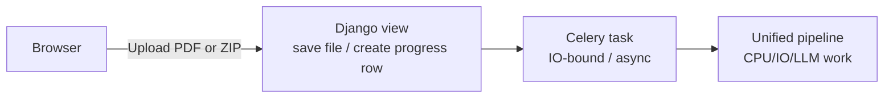
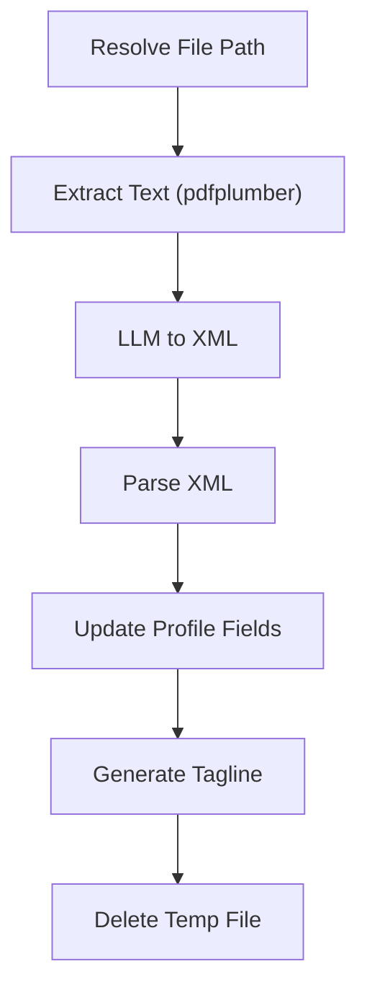

# Resume Processing Pipeline

This document explains **how PDF resumes flow through Hiredar – from the moment they are uploaded to the point where structured data is written back to the database**.  It is fully up-to-date with the April 2025 refactor that unified the parsing logic and introduced recruiter bulk upload support.

---

## 1. High-level lifecycle



1. A **PDF** is uploaded (either a single file by a job-seeker or a ZIP archive by a recruiter).
2. The file is saved to disk (or a temp file) and a **Celery** background task is queued via `safe_async_task`.
3. The background task calls the **unified `process_resume` pipeline** which:
   1. Extracts plain text from the PDF.
   2. Sends the text to an LLM which returns an **XML** payload.
   3. Parses the XML and maps the data onto a `JobSeekerProfile` instance.
   4. Creates an AI-generated "personal tagline".
4. After the pipeline finishes, hooks kick off any **follow-up tasks** (credit deduction, TalentSheet generation, temp-file cleanup, etc.).
5. The front-end polls a `ResumeProcessingTaskProgress` row until completion, then redirects the user.

---

## 2. Entry points

### 2.1  Single upload (job-seeker)
| Step | Code | Notes |
|------|------|-------|
|HTTP POST|`apps/job_seekers/views/resume_processing_views.py::ResumeUploadView.post`|– Validates file<br>– Calls `save_resume_file()` to write into `MEDIA_ROOT/resumes/`<br>– Creates a **`ResumeProcessingTaskProgress`** row for live progress bars<br>– Queues…|
|Task|`apps/resume_processing/tasks/resume_processing_tasks.py::handle_resume_upload_task`|– Fetches the existing `JobSeekerProfile` (owned by the user)<br>– Invokes `process_resume(file_path, profile, task_id)`|
|Hook|`apps/job_seekers/tasks/hooks.py::resume_processing_completed`|– Creates a **`ResumeProcessingJob`** (used by credit/quota logic)<br>– Asynchronously schedules role-recommendations & other notifications|

### 2.2  Bulk ZIP upload (recruiter)
| Step | Code | Notes |
|------|------|-------|
|HTTP POST|`apps/recruiters/views/bulk_upload_views.py::BulkResumeUploadView.form_valid`|– Validates credit balance (counts PDF resumes, errors if insufficient)<br>– If HTMX request, returns an error fragment with a "Buy More Credits" button<br>– Deducts credits up-front (one per PDF)<br>– Persists `BulkResumeUpload` row and enqueues processing|
|Task|`apps/recruiters/tasks/bulk_resume_tasks.py::unpack_and_process_zip`|– Extracts PDFs in-memory<br>– Creates an **`UploadedResumePool`** to "own" the generated profiles<br>– For each PDF it writes a temp file and queues `process_resume_for_pool()`|
|Child task|`apps/job_seekers/tasks/pool_tasks.py::process_resume_for_pool`|– Creates a **new** `JobSeekerProfile` owned by the pool (not the recruiter)<br>– Calls `process_resume(path, profile, task_id=None)` (no progress row – avoids noise)<br>– Schedules TalentSheet generation
|Cleanup hook|`apps/job_seekers/tasks/pool_tasks.py::cleanup_temp_resume_file`|– Deletes the temp file after each pool resume finishes|

**Why the ownership dance?**  Profiles generated from recruiter uploads belong to the `UploadedResumePool`, *not* to the recruiter's `User`.  This is because a recruiter can upload many resumes that are not backed by human users of the system, and need to be cordoned off from resumes that are provided by human job seekers. Additionally, recruiters might need or want to isolate clusters of resumes for matching with specific job openings, such as in cases where applicants to a specific job have provided their resumes for it offline.

---

## 3. Core pipeline – `apps/resume_processing/utils/pipeline.py::process_resume`



`process_resume` is *fully synchronous* – once the Celery worker starts it runs step-by-step, updating the `ResumeProcessingTaskProgress` row (if supplied) via `mark_step_complete()`.

Return payload example:
```python
{
    "success": True,
    "message": "Resume processed successfully",
    "profile_data": {...},      # parsed dict
    "pipeline_steps": ["file_path_resolved", …, "personal_tagline_generated"],
    "processing_time": 4.38,
}
```

### Utility helpers used by the pipeline
| Module | Responsibility |
|--------|----------------|
|`apps/resume_processing/utils/extraction.py`|`extract_text_from_pdf()` → pdfplumber wrapper|
|`apps/resume_processing/utils/llm_processor.py`|`convert_text_to_xml()` → OpenAI / Azure OpenAI call|
|`apps/resume_processing/utils/xml_parser.py`|Parses the XML and offers helpers (`extract_skills`, `calculate_years_experience`, …)|
|`apps/resume_processing/utils/profile_updater.py`|`update_profile_fields()` & `generate_and_save_personal_tagline()`|
|`apps/resume_processing/utils/xml_error_reporting.py`|Writes badly-formed XML to disk for later debugging|

---

## 4. Models involved

* `JobSeekerProfile` – single source of truth for candidate data.
* `ResumeProcessingTaskProgress` – front-end progress bar (one row per *single* upload).
* `ResumeProcessingJob` – immutable audit row per finished single-upload (drives credit/quota deduction).
* `BulkResumeUpload` – the top-level ZIP entity owned by a recruiter.
* `ResumeFile` – one row per PDF inside the ZIP.
* `UploadedResumePool` – logical container that owns the pool-generated `JobSeekerProfile`s.

---

## 5. Background task queue (Celery)

This project uses Celery for background tasks, wrapping calls through `apps.core.tasks.safe_async_task`.  All tasks are *fire-and-forget*.  Hooks (`hook=` kwarg) are used instead of task chains to keep the DAG explicit in code.

---

## 6. Progress tracking

Only **single** uploads create a `ResumeProcessingTaskProgress` row.  Workers update it by ID so the browser can poll `/job‐seekers/task/<task_id>/` (see `ResumeProcessingTaskProgressView`).  Bulk uploads intentionally skip this to avoid thousands of useless rows.

The steps, weights & messages live in `ResumeProcessingTaskProgress.RESUME_PROCESSING_STEPS`.

---

## 7. Credit / quota enforcement

The single-upload path (job-seeker) never consumes any credits.
For recruiter-initiated bulk uploads, credits are validated and deducted up-front in `apps/recruiters/views/bulk_upload_views.py::BulkResumeUploadView.form_valid`. One credit is removed per PDF in the ZIP.

---

## 8. Follow-up tasks

* **TalentSheet generation** – queued for every pool profile once a resume is parsed.
* **Role recommendations** – queued after a successful single upload.
* **Cleanup** – `cleanup_resume_processing_progress` runs on a cron (and opportunistically via the hook) to purge rows older than 5 minutes or 7 days depending on status.

---

## 9. Configuration

| Setting / Env var | Purpose |
|------------------|---------|
|`OPENAI_API_KEY`|LLM calls|
|`MEDIA_ROOT`|Where PDFs & temp files are stored|
|`LOGGING`|Verbose pipeline logs go to `logs/`|

---

## 10. Testing & diagnostics

### Management commands

```bash
# One-off PDF → debug output
python manage.py diagnose_resume path/to/resume.pdf

# Batch-ingest a directory of PDFs into fresh fake users
python manage.py ingest_resumes sample_data/resumes/
```

### Manual flow test
1. Run `./manage.py runserver` & a Celery worker.
2. Log in as a job-seeker, upload a resume, watch the progress bar.
3. Log in as a recruiter, upload a ZIP, then visit "Resume Pools".

---

## 11. Common failure points & mitigation

| Stage | Symptoms | Hints |
|-------|----------|-------|
|Text extraction|Empty text|Check if the PDF is scanned → run OCR first|
|LLM XML|`xml_generated` step hangs|Inspect OpenAI quota / network logs|
|XML parse|`ParseError`|See files in `media/resume_diagnostics/` for the raw XML|
|Profile update|Missing skills|Confirm the field mapping in `profile_updater.py`|

---

Happy debugging 🎉
